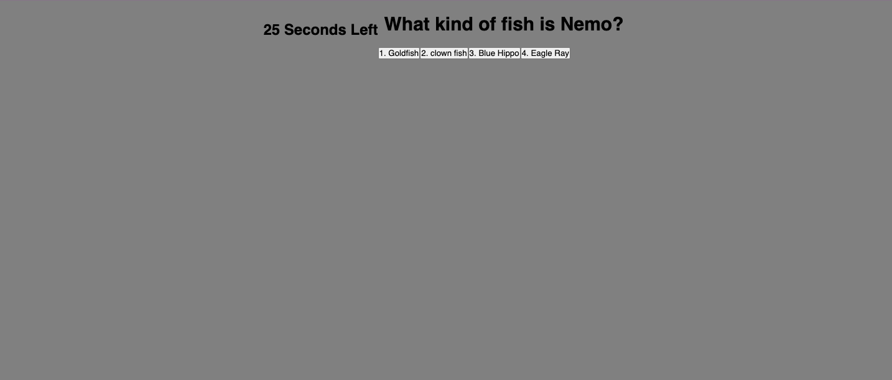
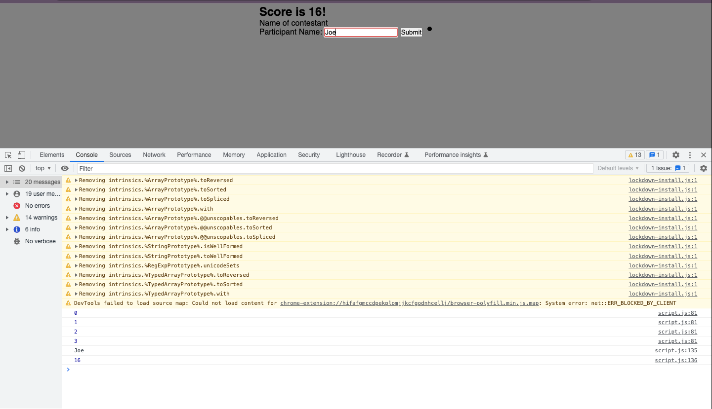

# Animated Quiz

work done with css, html and javascript

## description

- Facts of animated movies
- Guess right remain with points
- Guess wrong lose points
- Good luck

### In this quiz you'll be able to:

    >Start button when clicked will give you a timer to finish questions
    >Question is presented and timer runs
    >After answering question it will guide you to next question wheter is right or wrong
    >If questions answered incorrectly timer will substract seconds
    >And finally game will be over when all questions get answered or timer runs out
    >Initials will be written and score are going to be saved in the local storage

    ## Screenshot

Each have been developed and deploy has been made

#### Made by

[Jose Malave on Github](http://github.com/jmalave15)
